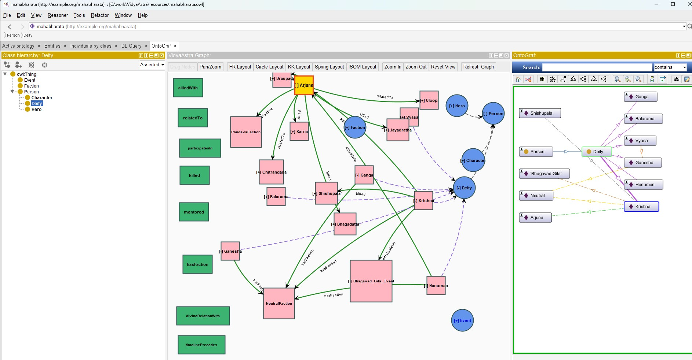

# VidyaAstra Plugin

**VidyaAstra** is an AI-powered plugin for Protégé that brings intelligent ontology visualization and AI integration capabilities to your knowledge engineering workflow.



## Features

### 🤖 AI Integration
**Query your ontology using natural language powered by Large Language Models**

- **Interactive AI Query Interface**: Ask questions about your ontology in plain English
- **Context-Aware Responses**: The AI understands your current ontology context
- **LLM Integration Ready**: Extensible architecture supports OpenAI, Azure OpenAI, and custom endpoints
- **Clean, Intuitive UI**: Separate query input and response display areas for easy interaction
- **Accessible from Tools Menu**: Quick access via **Tools > AI Integration - Send Query to LLM...**

### 📊 VidyaAstra Graph - Interactive Ontology Visualization
**Explore your ontology structure through powerful, interactive graph visualization**

- **Hierarchical Display**: Automatically shows class hierarchies with expand/collapse functionality
- **Instance Visualization**: View individuals and their relationships to classes
- **Object Property Relationships**: Expand individuals to see all their connections (just like OntoGraf!)
- **Visual Differentiation**: 
  - **Blue circles** for classes
  - **Pink squares** for individuals
  - **Green lines** for object properties
  - **Gray dashed lines** for class hierarchies
  - **Purple dashed lines** for instance relationships
- **Interactive Controls**:
  - **Double-click** nodes to expand/collapse relationships
  - **Drag** individual nodes to reposition
  - **Pan and Zoom** for easy navigation
  - **[+]/[-]** indicators show expandable/collapsible nodes
- **Multiple Layout Algorithms**: Choose from FR (Fruchterman-Reingold), Circle, KK (Kamada-Kawai), Spring, and ISOM layouts
- **Edge Labels**: See relationship names (alliedWith, mentored, killed, etc.) directly on the graph
- **Smart Node Sizing**: Nodes automatically resize to fit labels
- **Gold Selection Highlight**: Selected entities are highlighted in gold for easy identification

## Requirements

- **Java**: 11 or higher
- **Protégé**: 5.6.4 or higher
- **Maven**: 3.x (for building from source)

## Installation

1. **Build the plugin**:
   ```bash
   mvn clean package
   ```

2. **Copy the JAR** from `target/vidyaastra-1.0.0.jar` to your Protégé plugins folder:
   - **Windows**: `C:\Users\<username>\protege\Protege-5.6.x\plugins\`
   - **macOS**: `~/Library/Application Support/Protege/plugins`
   - **Linux**: `~/.Protege/plugins`

3. **Restart Protégé**

## Usage

### Using VidyaAstra Graph

1. Open your ontology in Protégé
2. Navigate to **Window > Views > Miscellaneous views > VidyaAstra Graph**
3. The graph displays root classes automatically
4. **Double-click** any class with **[+]** to expand and see:
   - Subclasses (connected with gray dashed lines)
   - Instances (connected with purple dashed lines)
5. **Double-click** any individual with **[+]** to see:
   - Related individuals via object properties (connected with green solid lines)
   - Property names displayed as edge labels
6. **Single-click** to select entities (turns gold)
7. Use toolbar buttons to:
   - Switch layout algorithms
   - Toggle between **Drag Nodes** and **Pan/Zoom** modes
   - Zoom in/out or reset view
   - Refresh the graph

### Using AI Integration

1. Open your ontology in Protégé
2. Navigate to **Tools > AI Integration - Send Query to LLM...**
3. Enter your query (e.g., "Explain the class hierarchy" or "What properties does Person have?")
4. Click **Send Query**
5. View AI-generated responses in the panel below

## Technology Stack

- **Protégé API** (5.6.4) - Ontology access and manipulation
- **JUNG 2.1.1** - Java Universal Network/Graph Framework for visualization
- **JGraphT 1.5.2** - Graph algorithms and data structures
- **OWL API** - Ontology processing
- **Apache POI** (5.4.0) - Document processing
- **Log4j 2** (2.20.0) - Logging


